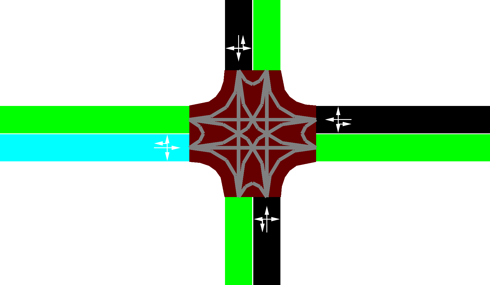
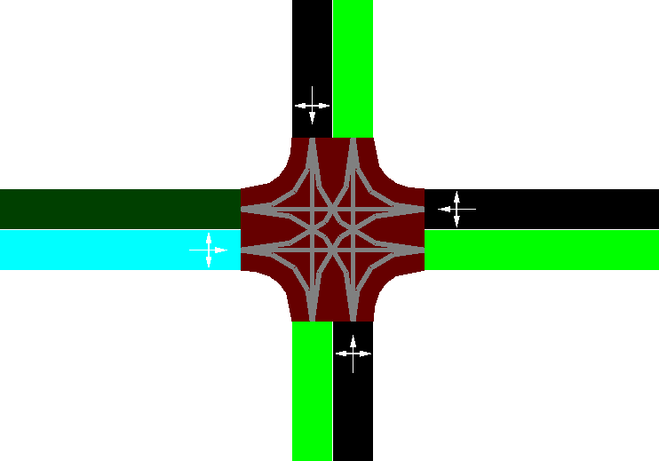
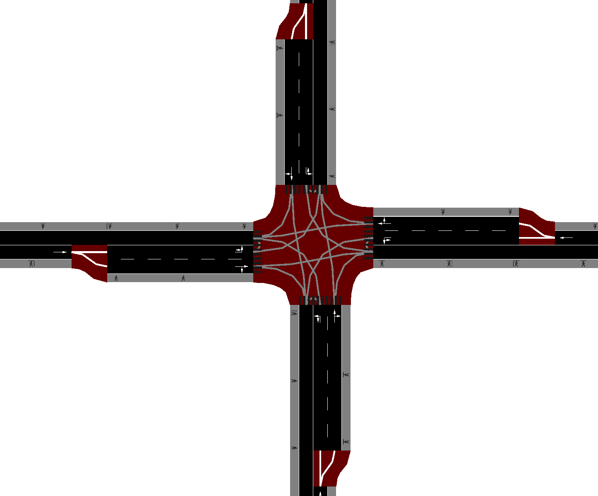

## Exercise 1

### Network from components

1. Creating `nodes.nod.xml` with nodes named `C`-center, `E`-east, `W`-west, `N`-north, `S`-south. Legs are chosen to be 200 meters.
```xml
<!--in nodes.nod.xml-->
<nodes>
    <node id="C" x="0.0" y="0.0"/>
    <node id="E" x="-200.0" y="0.0"/>
    <node id="W" x="200.0" y="0.0"/>
    <node id="N" x="0.0" y="200.0"/>
    <node id="S" x="0.0" y="-200.0"/>
</nodes>
```

2. Creating a road type in `types.type.xml` with 1 lane and max speed of 50 km/h that corresponds to 13.3 m/s according to [this doc](https://sumo.dlr.de/docs/Networks/PlainXML.html#type_descriptions).

```xml
<!--in types.type.xml-->
<types>
    <type id="1L13.3" numLanes="1" speed="13.3"/>
</types>
```

3. Creating incoming and outgoing approaches in `edges.edg.xml` and assigning the correct type.

```xml
<!--in edges.edg.xml-->
<edges>
    <edge from="E" to="C" id="EC" type="1L13.3"/>
    <edge from="W" to="C" id="WC" type="1L13.3"/>
    <edge from="N" to="C" id="NC" type="1L13.3"/>
    <edge from="S" to="C" id="SC" type="1L13.3"/>

    <edge from="C" to="E" id="CE" type="1L13.3"/>
    <edge from="C" to="W" id="CW" type="1L13.3"/>
    <edge from="C" to="N" id="CN" type="1L13.3"/>
    <edge from="C" to="S" id="CS" type="1L13.3"/>
</edges>

```

4. Converting the raw network components to a network file
```sh
netconvert -n nodes.nod.xml -e edges.edg.xml -t types.type.xml -o network.net.xml
```

Preview the network to see that it looks correct:
```sh
netedit network.net.xml
```


5. Looking at the connections in Network -> Connection Mode it looks like SUMO has created a turnaround connection for us. Lets specify that we only want forward, left and right turns to be available. Connections can be edited in `netedit` but instead we will make `connections.con.xml` based on [this doc](https://sumo.dlr.de/docs/Networks/PlainXML.html#connection_descriptions).

```xml
<!--in connections.con.xml-->
<connections>
  <connection from="EC" to="CN"/>
  <connection from="EC" to="CW"/>
  <connection from="EC" to="CS"/>

  <connection from="NC" to="CW"/>
  <connection from="NC" to="CS"/>
  <connection from="NC" to="CE"/>

  <connection from="WC" to="CS"/>
  <connection from="WC" to="CE"/>
  <connection from="WC" to="CN"/>

  <connection from="SC" to="CE"/>
  <connection from="SC" to="CN"/>
  <connection from="SC" to="CW"/>
</connections>
```

```sh
netconvert -n nodes.nod.xml -e edges.edg.xml -t types.type.xml -x connections.con.xml -o network.net.xml
```

Preview the network to see that it looks correct:
```sh
netedit network.net.xml
```


### Demand
To define the demand we need to create a `routes.rou.xml` file to specify:
- car and a bus vehicle types with `vType` tag
- 3 routes with `route` tag
- 3 car flows with `flow` tag
- 4 bus trips with `vehicle` tag (`trip` could be used too, but instead of route you need to provide `from` and `to` edge ids) 

We will use the parameters from [this doc](https://sumo.dlr.de/docs/Definition_of_Vehicles%2C_Vehicle_Types%2C_and_Routes.html#available_vehicle_attributes) to specify the demands:


```xml
<routes>
    <vType id="bus1" maxSpeed="20.00" vClass="bus" color="red"/>
    <vType id="car1" maxSpeed="50.00" vClass="passenger" color="green"/>

    <route edges="EC CN" color="yellow" id="routeEtoN"/>
    <route edges="EC CS" color="yellow" id="routeEtoS"/>
    <route edges="EC CW" color="yellow" id="routeEtoW"/>

    <flow id="c0" type="car1" begin="0.00" route="routeEtoN" end="500.00" number="50"/>
    <flow id="c1" type="car1" begin="0.00" route="routeEtoW" end="500.00" number="50"/>
    <flow id="c2" type="car1" begin="0.00" route="routeEtoS" end="500.00" number="50"/>

    <vehicle id="b0" type="bus1" depart="100.00" route="routeEtoN"/>
    <vehicle id="b1" type="bus1" depart="200.00" route="routeEtoN"/>
    <vehicle id="b2" type="bus1" depart="300.00" route="routeEtoN"/>
    <vehicle id="b3" type="bus1" depart="400.00" route="routeEtoN"/>
</routes>
```
*It is surely possible to define all of that using `netedit`, follow [this doc](https://sumo.dlr.de/docs/Netedit/elementsDemand.html) for more info.

### Simulation
Simulate the results
```sh
sumo-gui -n network.net.xml -r routes.rou.xml
```


## Part 2

### Network from components

1. Creating new nodes file `nodes2.nod.xml` with similar node names, however, this time each with an intermediate nodes `E2 W2 N2 S2` to define a double lane just before the intersection. Lets also make our intersection at node `C` more interesting by specifying a bigger turning `radius` as described in [this doc](https://sumo.dlr.de/docs/Networks/PlainXML.html#node_descriptions):

```xml
<!--in nodes2.nod.xml-->
<nodes>
    <node id="C" x="0.0" y="0.0" radius="5.00"/>

    <node id="E1" x="-200.0" y="0.0"/>
    <node id="E2" x="-50.0" y="0.0"/>

    <node id="W1" x="200.0" y="0.0"/>
    <node id="W2" x="50.0" y="0.0"/>

    <node id="N1" x="0.0" y="200.0"/>
    <node id="N2" x="0.0" y="50.0"/>

    <node id="S1" x="0.0" y="-200.0"/>
    <node id="S2" x="0.0" y="-50.0"/>
</nodes>
```

2. Extend the road types by creating `types2.type.xml` with an additional approach edge type that has 2 lane and similar max speed. According to [this doc](https://sumo.dlr.de/docs/SUMO_edge_type_file.html#syntax) the pedestrian paths are created automatically if we specify `sidewalkWidth` property.

```xml
<!--in types2.type.xml-->
<types>
    <type id="1L13.3" numLanes="1" speed="13.3" sidewalkWidth="2.00"/>
    <type id="2L13.3" numLanes="2" speed="13.3" sidewalkWidth="2.00"/>
</types>
```

Alternatively we could have describe lanes differently, by embedding them into the edge definitions as shown in [this doc](https://sumo.dlr.de/docs/Networks/PlainXML.html#lane-specific_definitions).

3. For the new edge definitions in `edges2.edg.xml` we need to specify 3 edges per approach:
- intermediate single lane edge given names like `EE`
- inbound double lane edge given names like `EC`
- outbound single edge given names like `CE`

```xml
<!--in edges2.edg.xml-->
<edges>
    <edge from="E1" to="E2" id="EE" type="1L13.3"/>
    <edge from="W1" to="W2" id="WW" type="1L13.3"/>
    <edge from="N1" to="N2" id="NN" type="1L13.3"/>
    <edge from="S1" to="S2" id="SS" type="1L13.3"/>
    

    <edge from="E2" to="C" id="EC" type="2L13.3"/>
    <edge from="W2" to="C" id="WC" type="2L13.3"/>
    <edge from="N2" to="C" id="NC" type="2L13.3"/>
    <edge from="S2" to="C" id="SC" type="2L13.3"/>

    <edge from="C" to="E1" id="CE" type="1L13.3"/>
    <edge from="C" to="W1" id="CW" type="1L13.3"/>
    <edge from="C" to="N1" id="CN" type="1L13.3"/>
    <edge from="C" to="S1" id="CS" type="1L13.3"/>
</edges>
```

4. Considering the connections we could have decided to customize them as in the previous part using [this doc](https://sumo.dlr.de/docs/Networks/PlainXML.html#explicitly_setting_which_edge_lane_is_connected_to_which), however, lets leave this job for `netconvert` and instead use the `connections2.con.xml` file to define crosswalks according to [this doc](https://sumo.dlr.de/docs/Networks/PlainXML.html#pedestrian_crossings). If we dont specify any connections in this file `netconvert` by default will generate all possible connections. 

```xml
<!--in connections2.con.xml-->
<connections>
    <crossing node="C" edges="EC CE" width="2.00"/>
    <crossing node="C" edges="NC CN" width="2.00"/>
    <crossing node="C" edges="WC CW" width="2.00"/>
    <crossing node="C" edges="SC CS" width="2.00"/>
</connections>
```
In the `crossing` we need to specify which `edges` does the crossing cross, in addition we can specify the width of the crossing. Finally, if we dont set the parameter `priority="true"` we get the behaviour where pedestrians have to wait for the vehicles. 

5. Lets build the network with `netconvert` and verify that it looks good using `netedit`.

```sh
netconvert -n nodes2.nod.xml -e edges2.edg.xml -t types2.type.xml -o network2.net.xml
netedit network2.net.xml
```



### Demand
Our network has grown bigger, therefore we will not specify routes in `routes2.rou.xml` explictly by naming all edges, but instead just provide `from` and `to` edge names and let the router module of SUMO do the work for us. For the pedestrians we will use `personFlow` as described in [this doc](https://sumo.dlr.de/docs/Specification/Persons.html#repeated_persons_personflows), `personFlow` definition is a bit more sophisticated since person can move using multiple modes of transport, we will limit ourself to `walk` definitions only. Lets add 100 pedestrians moving from north to south and west to east through our intersection every 5 seconds.

```xml
<!--in routes2.rou.xml-->
<routes>
    <vType id="bus1" maxSpeed="20.00" vClass="bus" color="red"/>
    <vType id="car1" maxSpeed="50.00" vClass="passenger" color="green"/>

    <flow id="c0" type="car1" begin="0.00" from="EE" to="CN" end="500.00" number="50"/>
    <flow id="c1" type="car1" begin="0.00" from="EE" to="CW" end="500.00" number="50"/>
    <flow id="c2" type="car1" begin="0.00" from="EE" to="CS" end="500.00" number="50"/>

    <trip id="b0" type="bus1" depart="100.00" from="EE" to="CN"/>
    <trip id="b1" type="bus1" depart="200.00" from="EE" to="CN"/>
    <trip id="b2" type="bus1" depart="300.00" from="EE" to="CN"/>
    <trip id="b3" type="bus1" depart="400.00" from="EE" to="CN"/>

    <personFlow id="p0" begin="0" end="500" period="5">
       <walk from="NN" to="SS"/>
   </personFlow>
    <personFlow id="p1" begin="0" end="500" period="5">
       <walk from="WW" to="EE"/>
   </personFlow>
</routes>
```

### Simulation
Simulate the results
```sh
sumo-gui -n network2.net.xml -r routes2.rou.xml
```
Persons might be difficult to notice due to their rendering, that can be changed in Edit -> Edit Visualisation or pressing F9.


