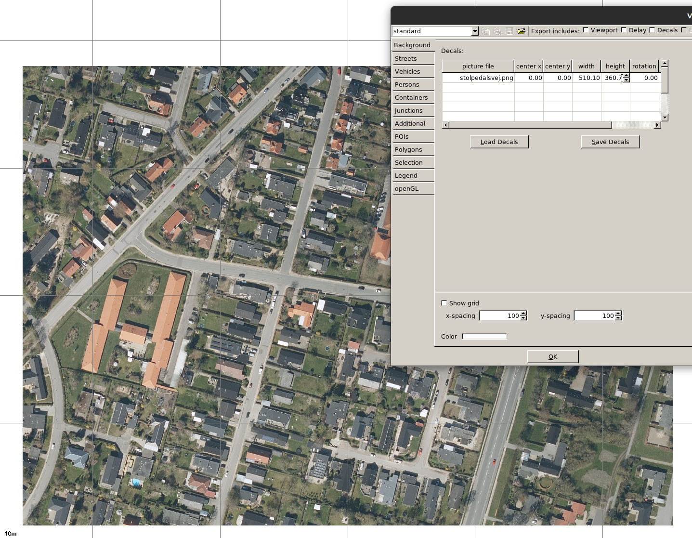
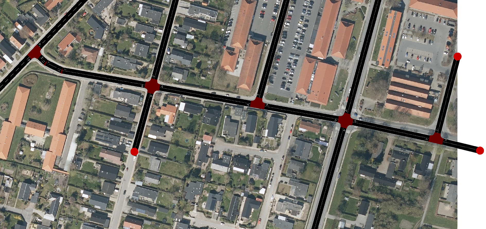
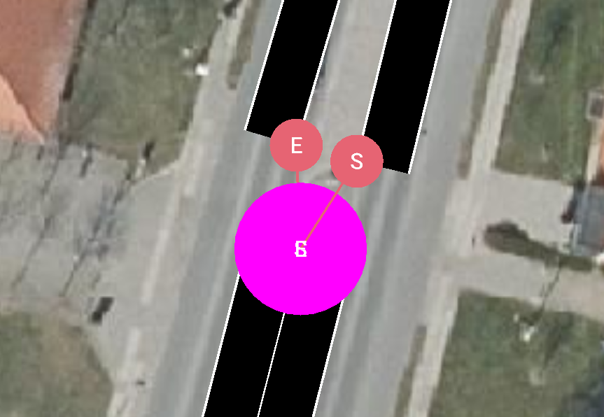
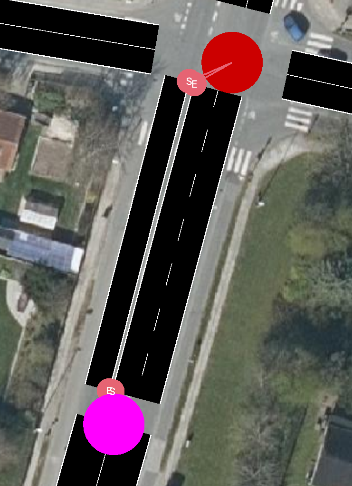
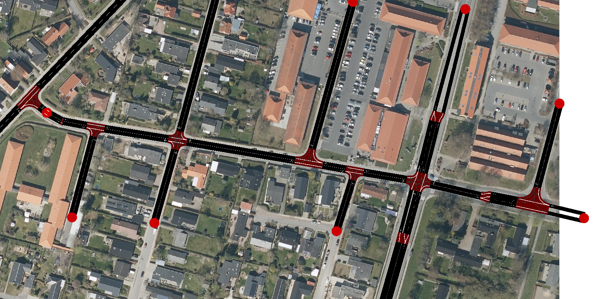
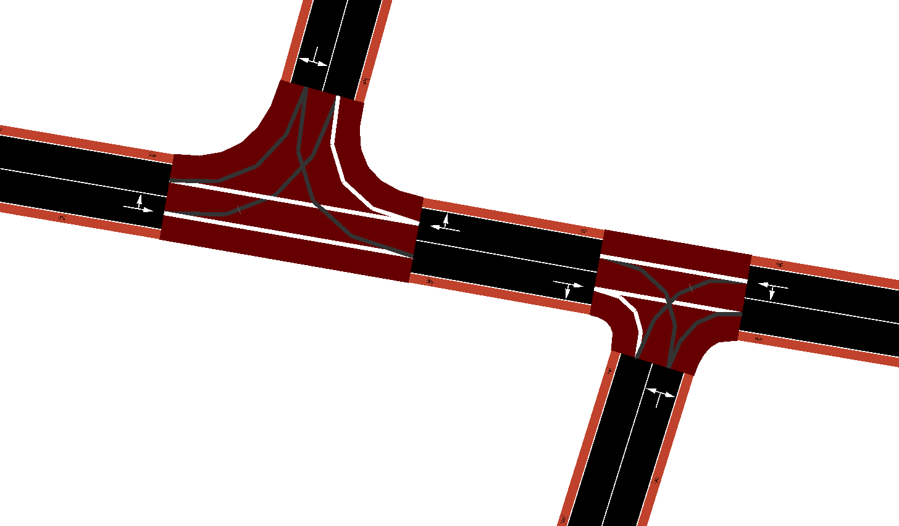
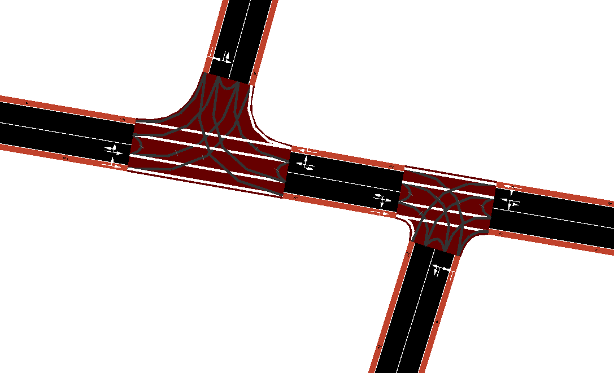
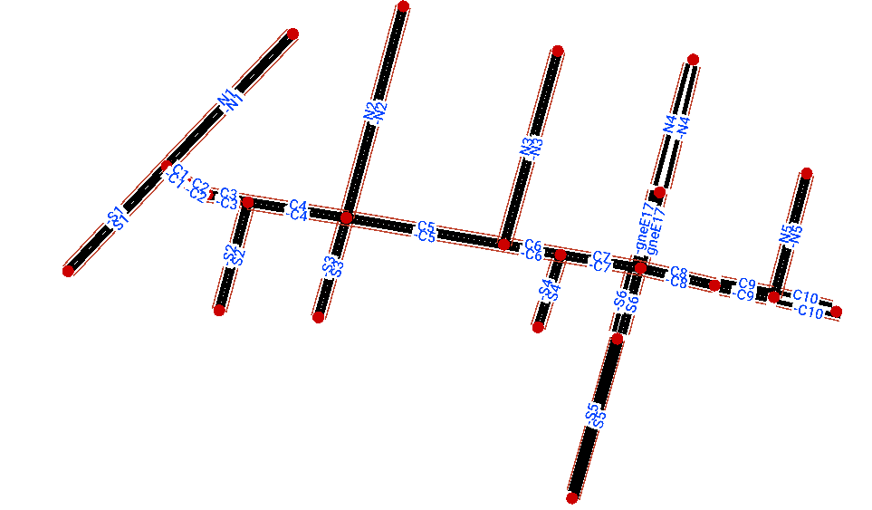
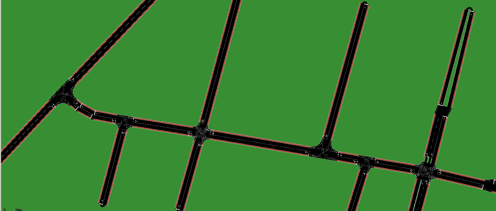
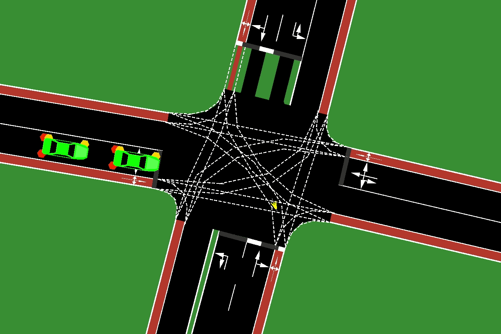

## Exercise 2

- Model your favourite street in Aalborg that contains at least 3 intersections. Figure out how draw the network on top of a background image layer with [this](https://sumo.dlr.de/docs/sumo-gui.html#showing_background_images) and [that](https://www.youtube.com/watch?v=rTT0vKzikpg&ab_channel=AkharapongTepkeaw) links.
- Find a way to add bicycle lanes using `netconvert`.

- Experiment with adding different demands:
  - Single trips
  - Flows
  - `randomTrips.py` from [this doc](https://sumo.dlr.de/docs/Tools/Trip.html) with / or without edge weights

### Image import
Lets try to model the [Stolpedalsvej in Aalborg](https://www.google.com/maps/@57.0355594,9.8815782,249m/data=!3m1!1e3). First step is to get a high resolution ortophoto with known boundary coordinates. QGIS can be used to get the `stolpedalsvej.png` image and its extents in UTM coordinates.
- `xmin = 553236.457`
- `ymin = 6321511.525`
- `xmax = 553746.574`
- `ymax = 6321872.214`


Image `width` is then `510.1m` and `height` is `360.7m`. We now want to put it to `netedit`. Using Edit -> Edit Visualisation (F9) the image background layer can be added to `netedit`.


By default the image is resized to a 100 by 100 m standart grid cell, using calculated width and height we can give the correct size to the image as follows:



### Network drawing
From that point we need to follow the road as closely as possible, locating the nodes at the centers of the intersection. Node positions can be changed using Network mode -> Move button. The roads crossing with the Stolpedalsvej are cut at some arbitrary length. Remember to draw edges in both directions.



The standart road edge width fits well in all the places except the Hasserisvej where on the north side we get a separating curb and on the south side road is wider. We can model the first case with edge properties `shapeStart` `shapeEnd` and second case with edge property `width`. Manual definition of `shapeStart` and `shapeEnd` is tedious since the offsets are in global coordinate system, luckily, `netedit` allows to isolate start and end points of the shape of the edge by shift + click on the edge according to [this doc](https://sumo.dlr.de/docs/Netedit/neteditUsageExamples.html#specifying_the_complete_geometry_of_an_edge_including_endpoints).




This lets us define more advanced intersection geometry that doesn`t have to co-incide with the main node of the intersection. We will not bother editing the connections as they look reasonable for this exercise. Also, the traffic controls on the Hasserisvej-Stolpedalsvej is not modelled, since its outside of the scope of this exercise.



This network is saved as `stolpedalsvej.net.xml`.

### Adding bike lanes

According to [this doc](https://sumo.dlr.de/docs/netconvert.html) `netconvert` has plenty of ways to enchance the network. One of the available parameters is `--bikelanes.guess`, lets tdy to generate `stolpedalsvej2.net.xml` from the previously drawn network.

```sh
netconvert --sumo-net-file stolpedalsvej.net.xml --output-file stolpedalsvej2.net.xml --bikelanes.guess
```
Unfortunately during the `netconvert` call we got issued a dozen of warnings:
```
Warning: Lane '-gneE10_0' is not connected from any incoming edge at junction 'gneJ14'.
```

That according to [this doc](https://sumo.dlr.de/docs/netconvert.html#warnings_during_import) is best resolved by inspecting the network visually. Looking at the new network in the `netedit` we can indeed see that the bike lanes are added to the edges, but are not connected propperly to eachother.



Apart from adding the connections manually in `netedit`, a good timesaving alternative is to rebuilding entire network from its node and edge files using `netconvert`. To acheive that we first need to split the network into its nodes and edges as follows.

```sh
netconvert --sumo-net-file stolpedalsvej.net.xml --plain-output-prefix stolpedalsvej
```

The results of that command are the files `stolpedalsvej.nod.xml`, `stolpedalsvej.edg.xml`, `stolpedalsvej.con.xml`, `stolpedalsvej.tll.xml`, last 2 files corresponding to connections and traffic lights we can ignore and re-build the network only using the nodes and edges. `netconvert` will build all the connections from scratch keeping in mind our request about bikelanes.

```sh
netconvert --node-files stolpedalsvej.nod.xml --edge-files stolpedalsvej.edg.xml --bikelanes.guess --output-file stolpedalsvej2.net.xml
```

This time no warnings was issued so we can inspect the new network and verify that all the bike paths are now connected.



Last thing before starting with the demand will be to take care of the edge naming on our network, since we will use `from` `to` parameters of the router to define the sources and the destinations of our trips. The naming system is arbitrary, i have decided to name southern origin edges as `S1, S2, ...`, and southern destination edges as `-S1, -S2, ...`. Same principle goes to the northern part, and the central part being Stolpedalsvej itself.



This concludes network building of this exercise.

### Single trips and flows
Similar to exercise 1, lets define single trips of busses and flows of cars in `routes1.rou.xml`. The cars will go from Thorsens Alle south to the Hasserisvej north and the busses will travel from Stolpedasvej east to Thorsens Alle north.

```xml
<!--in routes1.rou.xml-->
<routes>
    <vType id="bus1" maxSpeed="20.00" vClass="bus" color="red"/>
    <vType id="car1" maxSpeed="50.00" vClass="passenger" color="green"/>

    <flow id="c0" type="car1" begin="0.00" from="S1" to="-N4" end="200.00" number="50"/>

    <trip id="b0" type="bus1" depart="50.00" from="C10" to="-N1"/>
    <trip id="b1" type="bus1" depart="100.00" from="C10" to="-N1"/>
    <trip id="b2" type="bus1" depart="150.00" from="C10" to="-N1"/>
    <trip id="b3" type="bus1" depart="200.00" from="C10" to="-N1"/>
</routes>
```

Simulate the results
```sh
sumo-gui -n stolpedalsvej2.net.xml -r routes1.rou.xml
```



### Random trips for cyclists
Lets add cyclists using `randomTrips.py` tool described in [this doc](https://sumo.dlr.de/docs/Tools/Trip.html). Cyclists in SUMO are no different from vehicles, they use the same default Krauss car following model with slightly different parameters. In order to specify that we would like to generate trips for a particular `vType` we need to provide `randomTrips.py` with `--vehicle-class` argument as shown in [this doc](https://sumo.dlr.de/docs/Tools/Trip.html#automatically_generating_a_vehicle_type). The `--prefix` argument is used to avoid `id` collisions with other trips that we generated before. We are generating a cyclist trip every 3 seconds until timestep 200. Finally `--validate` argument is important, because by default `randomTrips.py` does not check whether the `from`-`to` edges are connected by a route. As a result of the validation some routes will be thrown away. Since `randomTrips.py` is one of SUMO's python tools, it resides in a folder `tools` under `SUMO_HOME` path.

Windows version:
```sh
python "%SUMO_HOME%\tools\randomTrips.py" -n stolpedalsvej2.net.xml --vehicle-class bicycle --prefix cyc --period 3 --end=200 -o cyclists.rou.xml --validate
```

macOS/Linux version:
```sh
python $SUMO_HOME/tools/randomTrips.py -n stolpedalsvej2.net.xml --vehicle-class bicycle --prefix cyc --period 3 --end=200 -o cyclists.rou.xml --validate
```

Generated `cyclists.rou.xml` file looks as follows:
```xml
<!--in cyclists.rou.xml-->
<routes xmlns:xsi="http://www.w3.org/2001/XMLSchema-instance" xsi:noNamespaceSchemaLocation="http://sumo.dlr.de/xsd/routes_file.xsd">
    <vType id="cyc_bicycle" vClass="bicycle"/>
    <trip id="cyc0" type="cyc_bicycle" depart="0.00" from="N1" to="-C1"/>
    <trip id="cyc2" type="cyc_bicycle" depart="6.00" from="N4" to="C1"/>
    <trip id="cyc6" type="cyc_bicycle" depart="18.00" from="-C1" to="-C6"/>
    <trip id="cyc7" type="cyc_bicycle" depart="21.00" from="N1" to="-S3"/>
    <trip id="cyc9" type="cyc_bicycle" depart="27.00" from="S1" to="-C1"/>
    <trip id="cyc12" type="cyc_bicycle" depart="36.00" from="S6" to="-N2"/>
    ...
```

As you can see we are having `bicycle` trips and some routes have been thrown away. We can adjust our random trip generation so that the bigger roads are more likely to become a source or a destination of a cyclists trip. We will do it using weight files and `--weight-prefix` parameter of `randomTrips.py` according to [this doc](https://sumo.dlr.de/docs/Tools/Trip.html#customized_weights). First let's create file describing distribution of source edges `cyclists_edge_weights.src.xml` and destination edges `cyclists_edge_weights.dst.xml`.

```xml
<!--in cyclists_edge_weights.src.xml-->
<edgedata>
    <interval id="src" begin="0" end="200">
        <edge id="S1" value="1.00"/>
        <edge id="N1" value="1.00"/>
        <edge id="S5" value="2.00"/>
        <edge id="N4" value="2.00"/>
        <edge id="C10" value="3.00"/>
    </interval>
</edgedata>
```
```xml
<edgedata>
<!--in cyclists_edge_weights.dst.xml-->
    <interval id="dst" begin="0" end="200">
        <edge id="-S1" value="1.00"/>
        <edge id="-N1" value="1.00"/>
        <edge id="-S5" value="2.00"/>
        <edge id="-N4" value="2.00"/>
        <edge id="-C10" value="3.00"/>
    </interval>
</edgedata>
```
For this example it was chosen to define trips only starting and ending at the 3 main roads Thorsens Alle, Hasserisvej and Stolpedasvej. All the weights will be automaically calculated into probabilities we and ff a loaded weight file does not contain all edges, probability 0 will be assumed for the missing edges. As you can also see the edge weights are enclosed into intervals, which potentially lets you define a time dependent distribution of routes.

Building random trips the follows the same procedure as above: 

Windows version:
```sh
python "%SUMO_HOME%\tools\randomTrips.py" -n stolpedalsvej2.net.xml --vehicle-class bicycle --prefix cyc --period 3 --end=200 --weights-prefix cyclists_edge_weights -o cyclists.rou.xml --validate
```

macOS/Linux version:
```sh
python $SUMO_HOME/tools/randomTrips.py -n stolpedalsvej2.net.xml --vehicle-class bicycle --prefix cyc --period 3 --end=200 --weights-prefix cyclists_edge_weights -o cyclists.rou.xml --validate
```
    

Result with both vehicles and cyclists can be simulated by listing our `*.rou.xml` files with comma and without a space as shown below. Alternative one can create a `*.sumocfg` file as shown in [this doc](https://sumo.dlr.de/docs/Tutorials/Hello_SUMO.html#configuration).

```xml
sumo-gui -n stolpedalsvej2.net.xml -r routes1.rou.xml,cyclists.rou.xml
```




