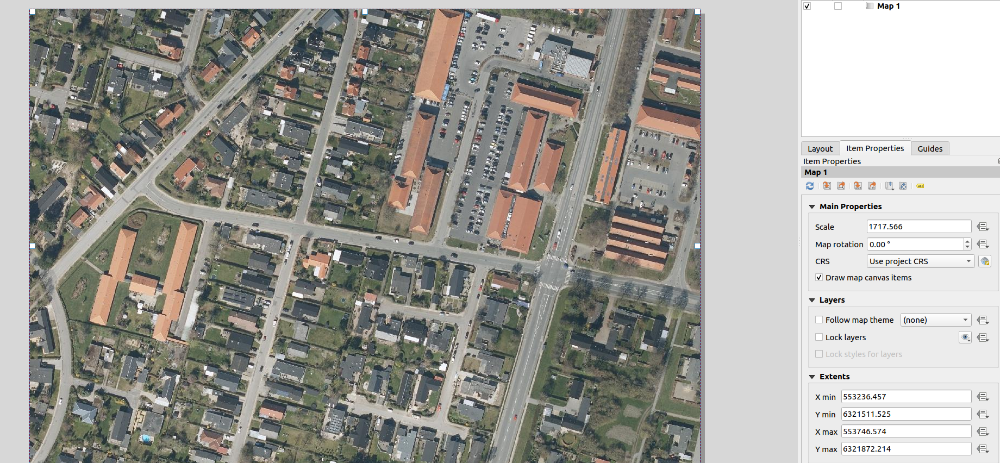
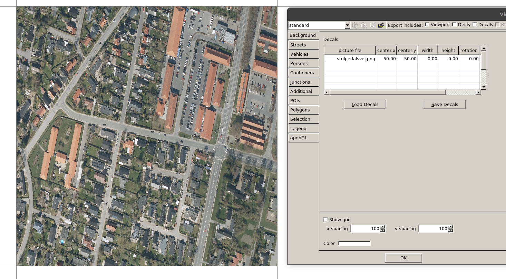

## Exercise 2

- Model your favourite street in Aalborg that contains at least 3 intersections. 
- Figure out how to use a background image layer with [this](https://sumo.dlr.de/docs/sumo-gui.html#showing_background_images) and [that](https://www.youtube.com/watch?v=rTT0vKzikpg&ab_channel=AkharapongTepkeaw) links.
- Model the layout using the `netedit` tool, and save your network.
- Split the network model into to the raw `*.xml` files, use one of the files to add bicycle lanes to your model, which one should it be?
- Merge the raw `*.xml` files back into the network file, open it in `netedit` and verify that everything is correct.
- Are the connections between bicycle lanes established?
- Experiment with adding different demands:
  - Single trips.
  - Flows.
  - `randomTrips.py` with / or without edge weights.
  - Turn ratios using [this doc](https://sumo.dlr.de/docs/Tools/Turns.html).
  - OD matrix with `od2trips.py` tool using [this doc](https://sumo.dlr.de/docs/Demand/Importing_O/D_Matrices.html).

### Image import
Lets try to model the [Stolpedalsvej in Aalborg](https://www.google.com/maps/@57.0355594,9.8815782,249m/data=!3m1!1e3). First step is to get a high resolution ortophoto with known boundary coordinates. QGIS can be used to get the `stolpedalsvej.png` image and its extents in UTM coordinates.
- `xmin = 553236.457`
- `ymin = 6321511.525`
- `xmax = 553746.574`
- `ymax = 6321872.214`

That gives us `width` of `510.1m` and `height` of `360.7m`.

This gives is an image width and image center that want to put it to `netedit`. Using Edit -> Edit Visualisation (F9) the image can shown inside `netedit`. 

By default the image is resized to a 100 by 100 m standart grid cell, using calculated width and height we can give the correct size to the image as follows:

### Network drawing

### Adding bike lanes

### Traffic demand composed of vehicles, busses and bicycles
- Single trips for busses
- Flows for vehicles and bicycles

random trips for vehicles and bicycles

