## Exercises 1 
## Part 1
- Model an intersection from Exercise 1 TT-5 and generate corresponding demands
- Visualize how the intersection functions without TLS
- Add a pre-timed TLS to the intersection with your phase and durations times and generate `tripinfo` type output
- Calculate pre-timed TLS with SUMO optimization using https://sumo.dlr.de/docs/Tools/tls.html#tlscycleadaptationpy 
- Compare those 2 scenarios using the trip statistics tool https://sumo.dlr.de/docs/Tools/Output.html#tripstatisticspy

### Part 1 modelling te network
Lets model the `network.net.xml` in `netedit` using a background image similar to lecture 1 exercise 2. On upload the image dimensions will be 100 by 100 meters. Lets use lane width hints in the image to recalculate image dimensions so that we draw in the correct units. To do it lets draw a dummy edge next to the lane width measurements and check what edge`s length.

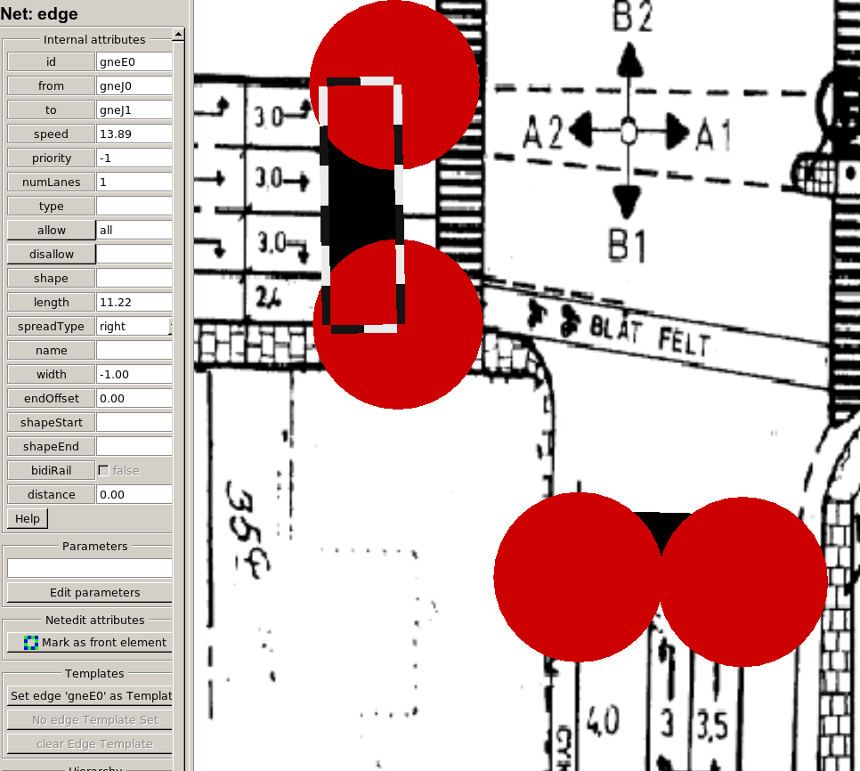

New approximate dimensions are then calculated as follows:

`new_height = (3.0 + 3.0 + 3.0 + 2.4) / 11.22 * 100 = 102 m`

`new_width = (4.0 + 3.0 + 3.5) / 7.73 * 100 = 136 m`

Given the correct scale lets outline the network first without worrying to much about the correct size. Here i just pay attention to placing nodes approximately where a change in geometry happens.

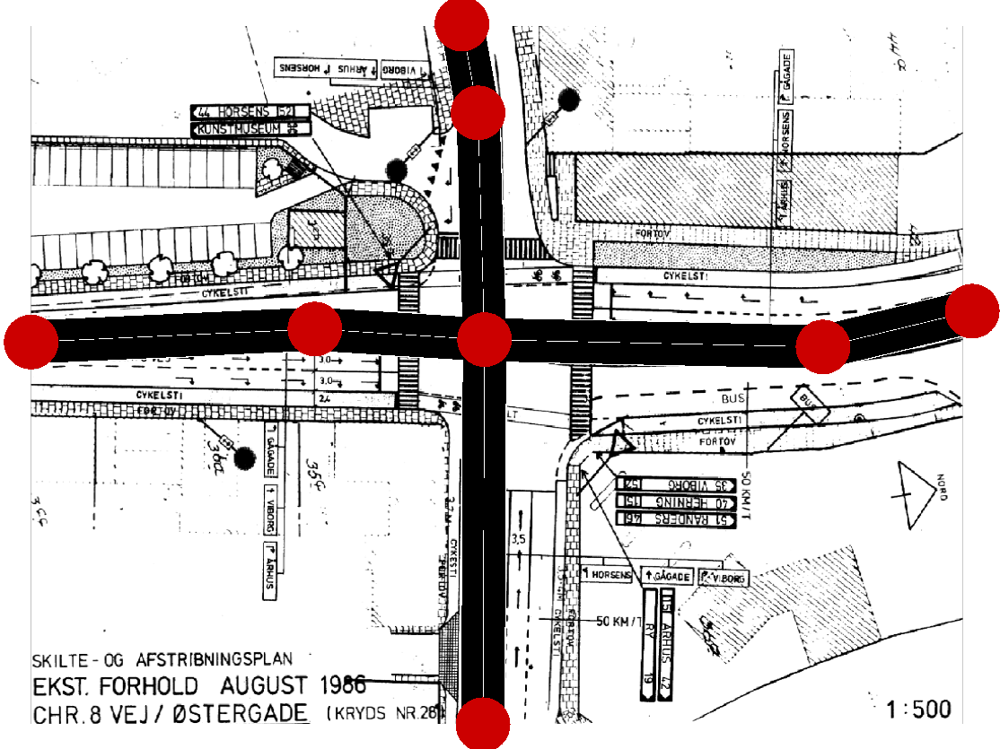

With the basic geometry covered, lets add correct number of lanes and set lane widths described in the image.

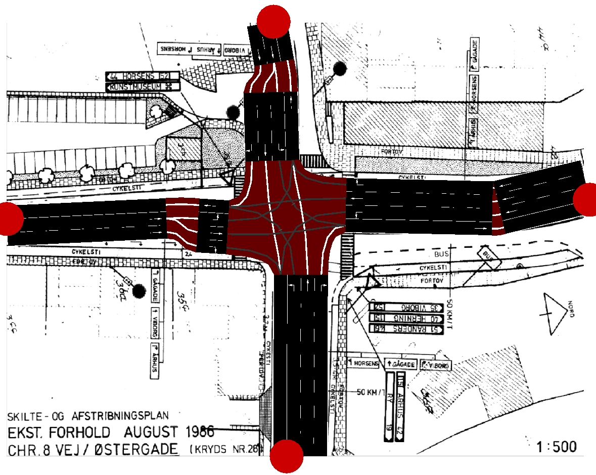

Next we will use the Move mode to allign the network well with the background image. Move nodes around and add offsets with Shift + Left Click similar to lecture 1 exercise 2 until you are satisfied with the result.

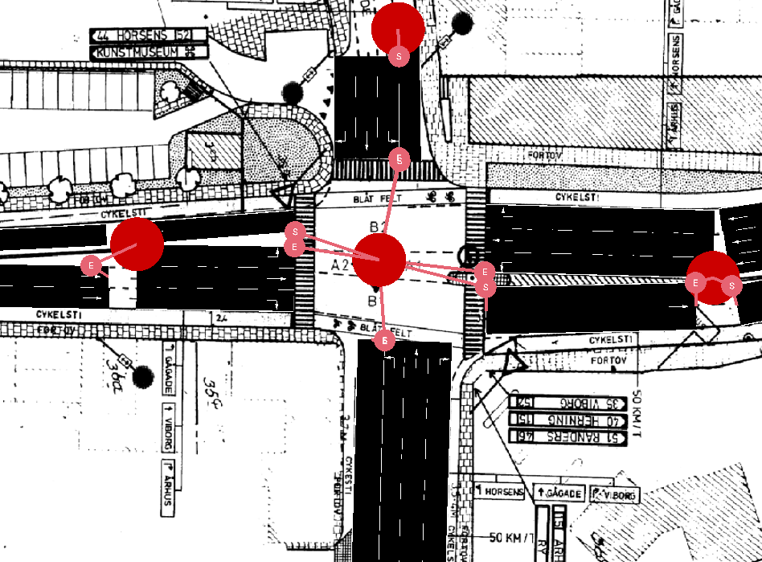

Final step before adding the demands is to come up with meaningful names for the nodes and edges. For example:

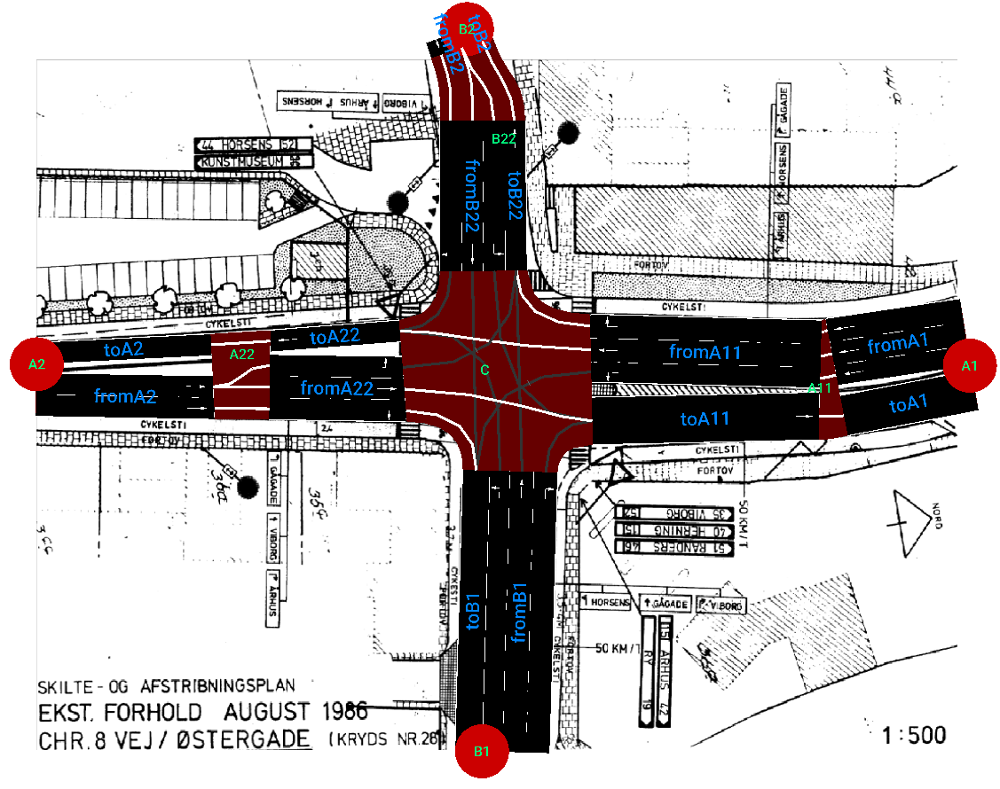

### Demand generation
From each origin lets generate 3 routes - forward, to the left and to the right. Route generation can be done in `nededit` by going to Demand Mode -> Route Mode and selecting edges belonging to the route.

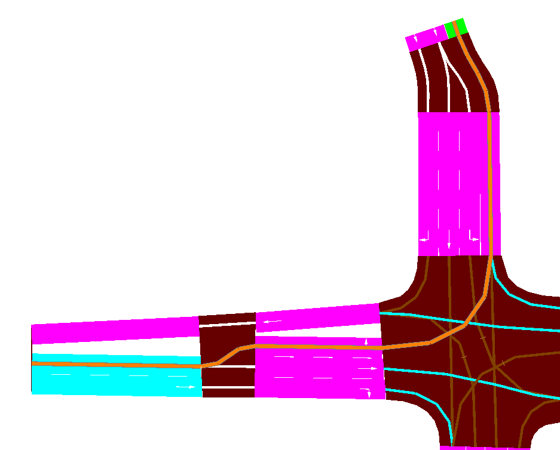

There is an often confusing difference between the route shape when you define a route and when the route has been created. Next picture suggests that the route starts from the right turnung lane and a vehicle will make an illegal left turn from there. This is not true and is mostly a visualization issue because `netedit` snaps the route line to the origin of the start edge. Remember that route are defined between edges, and its a job of a simulator to decide on correct and timely lane switches to follow the route.

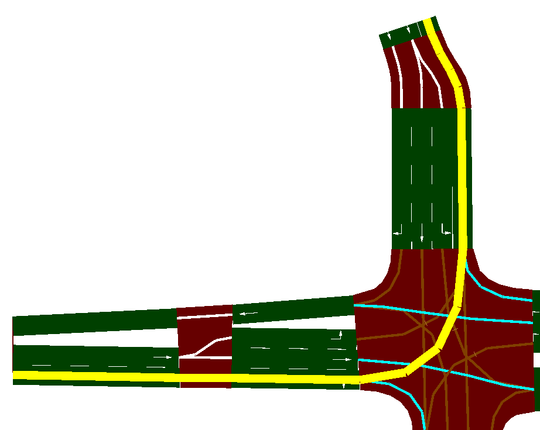

Finishing all the routes looks as follows:

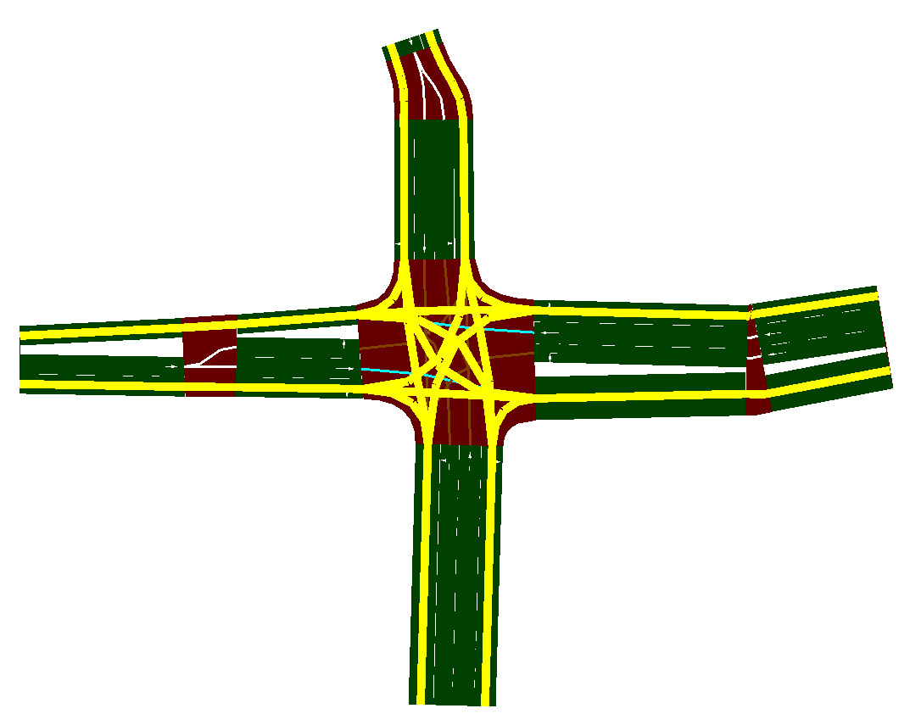

We will continue with the flows outside of `netedit` by saving `demands.rou.xml` demnad file and editing it to add `flow` with `vehsPerHour` parameter according to [this doc](https://sumo.dlr.de/docs/Definition_of_Vehicles%2C_Vehicle_Types%2C_and_Routes.html#repeated_vehicles_flows). The resulting file content is shown below. For better readablity the xml schema verification header and the route color property were ommited.
```xml
<routes>
<!-- in demands.rou.xml -->
    <route edges="fromA1 fromA11 toA22 toA2" id="A1forward"/>
    <route edges="fromA1 fromA11 toB1" id="A1left"/>
    <route edges="fromA1 fromA11 toB22 toB2" id="A1right"/>
    <route edges="fromA2 fromA22 toA11 toA1" id="A2forward"/>
    <route edges="fromA2 fromA22 toB22 toB2" id="A2left"/>
    <route edges="fromA2 fromA22 toB1" id="A2right"/>
    <route edges="fromB1 toB22 toB2" id="B1forward"/>
    <route edges="fromB1 toA22 toA2" id="B1left"/>
    <route edges="fromB1 toA11 toA1" id="B1right"/>
    <route edges="fromB2 fromB22 toB1" id="B2forward"/>
    <route edges="fromB2 fromB22 toA11 toA1" id="B2left"/>
    <route edges="fromB2 fromB22 toA22 toA2" id="B2right"/>
</routes>
```

Now we can add a `vType` and `flow` definitions between `<routes> <\routes>` tags. Up until now we have used a static `vType` and all vehicles had the same characteristics, to come closer to modelling real traffic flow lets experiment with vehicle distributions according to [this doc](https://sumo.dlr.de/docs/Definition_of_Vehicles%2C_Vehicle_Types%2C_and_Routes.html#route_and_vehicle_type_distributions).

```xml
<!-- in demands.rou.xml -->
...

    <vTypeDistribution id="dvehicles">
        <vType id="type1" accel="1.8" length="4" maxSpeed="50" color="1,1,0" probability="0.3"/>
        <vType id="type2" accel="2.5" length="5" maxSpeed="60" color="1,0,1" probability="0.5"/>
        <vType id="type3" accel="1.0" length="6" maxSpeed="40" color="0,1,1" probability="0.2"/>
    </vTypeDistribution>

```

Now our custom vehicle type `dvehicles` can be used as a `type` parameter to the `flow` definition.

```xml
<!-- in demands.rou.xml -->
...
    <flow id="fA1left" type="dvehicles" begin="0" end= "3600" vehsPerHour="175" route="A1left"/>
    <flow id="fA1forward" type="dvehicles" begin="0" end= "3600" vehsPerHour="725" route="A1forward"/>
    <flow id="fA1right" type="dvehicles" begin="0" end= "3600" vehsPerHour="106" route="A1right"/>

    <flow id="fB1left" type="dvehicles" begin="0" end= "3600" vehsPerHour="100" route="B1left"/>
    <flow id="fB1forward" type="dvehicles" begin="0" end= "3600" vehsPerHour="475" route="B1forward"/>
    <flow id="fB1right" type="dvehicles" begin="0" end= "3600" vehsPerHour="125" route="B1right"/>

    <flow id="fA2left" type="dvehicles" begin="0" end= "3600" vehsPerHour="17" route="A2left"/>
    <flow id="fA2forward" type="dvehicles" begin="0" end= "3600" vehsPerHour="497" route="A2forward"/>
    <flow id="fA2right" type="dvehicles" begin="0" end= "3600" vehsPerHour="253" route="A2right"/>

    <flow id="fB2left" type="dvehicles" begin="0" end= "3600" vehsPerHour="70" route="B2left"/>
    <flow id="fB2forward" type="dvehicles" begin="0" end= "3600" vehsPerHour="330" route="B2forward"/>
    <flow id="fB2right" type="dvehicles" begin="0" end= "3600" vehsPerHour="30" route="B2right"/>
```

Simulating the intersection with given demands shows that the organization of traffic with signalized intersection is absolutely necessary.

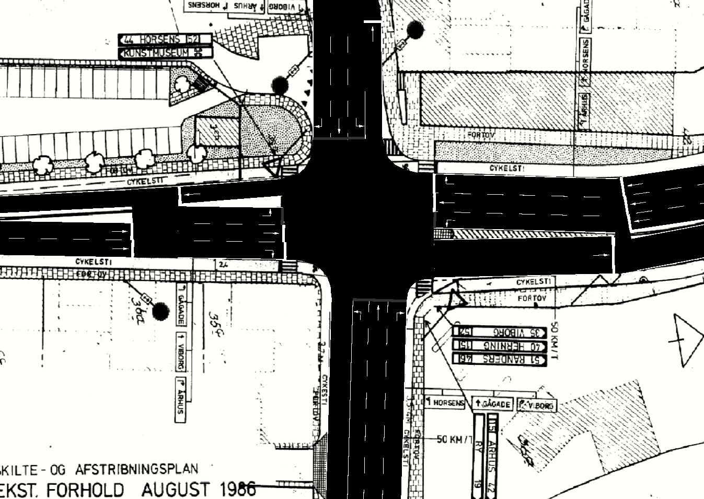

### Traffic light generation
Traffic lights can be generated in `netedit` by pressing on Traffic Light mode in Network mode, selecting a junction and pressing Create. 

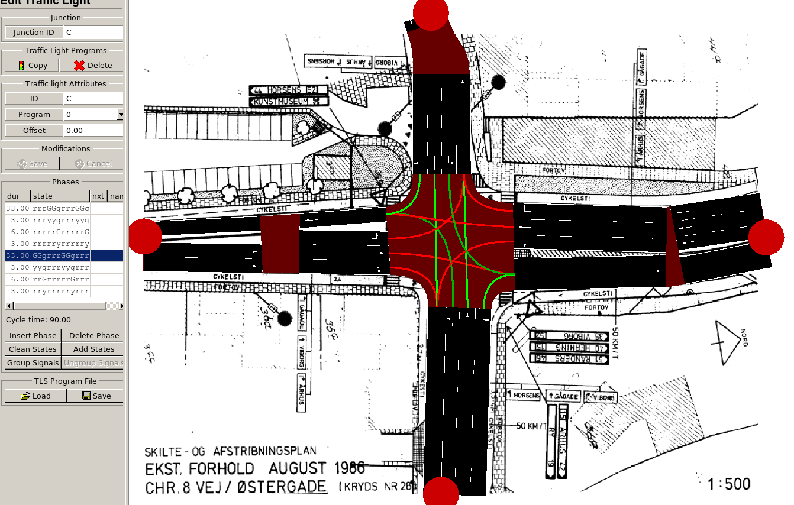

For our network `netedit` automaticaly came up with the following phases that can be saved to `lights.add.xml` and then viewed using File -> Traffic Lights -> Save TLS Programs as:

```xml
<!-- in lights.add.xml -->
<additionals>
    <tlLogic id="C" type="static" programID="0" offset="0">
        
        <!-- West-East-->
        <phase duration="33" state="rrrGGgrrrGGg"/>
        <phase duration="3"  state="rrryygrrryyg"/>
        <phase duration="6"  state="rrrrrGrrrrrG"/>
        <phase duration="3"  state="rrrrryrrrrry"/>
        <!-- North-South-->
        <phase duration="33" state="GGgrrrGGgrrr"/>
        <phase duration="3"  state="yygrrryygrrr"/>
        <phase duration="6"  state="rrGrrrrrGrrr"/>
        <phase duration="3"  state="rryrrrrryrrr"/>
    </tlLogic>
</additionals>

We can see that for each direction we have a phase with all maneuvers, left turn phase plus transition phases inbetween.
```
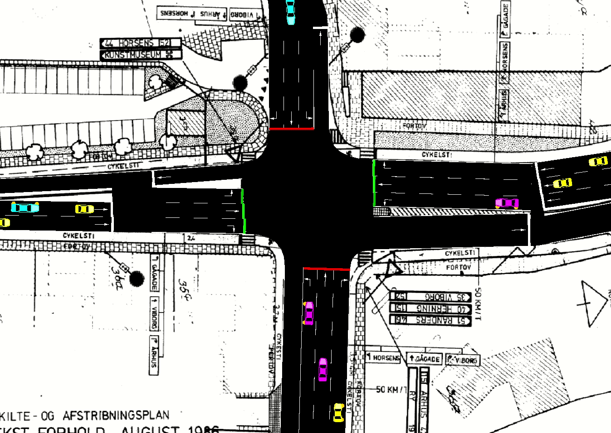

### Traffic plan optimization
Lets try to use one of the SUMO python tools `tlsCycleAdaptation.py` to optimize the phase times accrding to [this doc](https://sumo.dlr.de/docs/Tools/tls.html#tlscycleadaptationpy). Unlike our shorthand demand definitions `flow` and `trip` from [this doc](https://sumo.dlr.de/docs/Demand/Shortest_or_Optimal_Path_Routing.html) the tool description says that it only supports full demand definition of de the type `vehicle`. We will use `duarouter` that performs [Dynamic User Assignment](https://sumo.dlr.de/docs/Demand/Dynamic_User_Assignment.html) to obtain the correct demand format.

```sh
duarouter --route-files demands.rou.xml --net-file network.net.xml --output-file vehicle_demands.rou.xml
```

As a result we got a file with the following content that, however, represents exactly the same traffic as our `route` and `flow` definitions.

```xml
<!-- vehicle_demands.rou.xml-->
<routes>
    <vType id="type2" length="5.00" maxSpeed="60.00" probability="0.50" color="magenta" accel="2.5"/>
    <vehicle id="fA1forward.0" type="type2" depart="0.00">
        <route edges="fromA1 fromA11 toA22 toA2"/>
    </vehicle>
    <vehicle id="fA1left.0" type="type2" depart="0.00">
        <route edges="fromA1 fromA11 toB1"/>
    </vehicle>
    <vehicle id="fA1right.0" type="type2" depart="0.00">
        <route edges="fromA1 fromA11 toB22 toB2"/>
    </vehicle>

    ...

<routes/>
```

And now we can calculate the optimal phase durations as follows:

Windows:
```sh
python "%SUMO_HOME%\\tools\\tlsCycleAdaptation.py" -n network.net.xml -r vehicle_demands.rou.xml -o optimal_lights.add.xml --verbose
```

Linux:
```sh
python $SUMO_HOME/tools/tlsCycleAdaptation.py -n network.net.xml -r vehicle_demands.rou.xml -o optimal_lights.add.xml --verbose
```

```xml
<!-- in optimal_lights.add.xml-->
<?xml version="1.0" encoding="UTF-8"?>
<additional>
    <tlLogic id="C" type="static" programID="a" offset="0">
        
        <!-- West-East-->
        <phase duration="21" state="rrrGGgrrrGGg"/>
        <phase duration="3" state="rrryygrrryyg"/>
        <phase duration="9" state="rrrrrGrrrrrG"/>
        <phase duration="3" state="rrrrryrrrrry"/>
        
        <!-- North-South-->
        <phase duration="15" state="GGgrrrGGgrrr"/>
        <phase duration="3" state="yygrrryygrrr"/>
        <phase duration="5" state="rrGrrrrrGrrr"/>
        <phase duration="3" state="rryrrrrryrrr"/>
    </tlLogic>
</additional>
```

As you can see, the cycle time got shorter especially on the North-South direction. Also left turning phase of the West-East is almost twice longer than in North-South, which make sense given the biggest left turning demand comes from cars travelling between `fromA1` and  `toB2` edges. Notice the cycle time has become shorter without changing the all red and transition times. What could it potentially lead to? Lets preview the results: 

```
sumo-gui -n network.net.xml -r demands.rou.xml -a optimal_lights.add.xml 
```

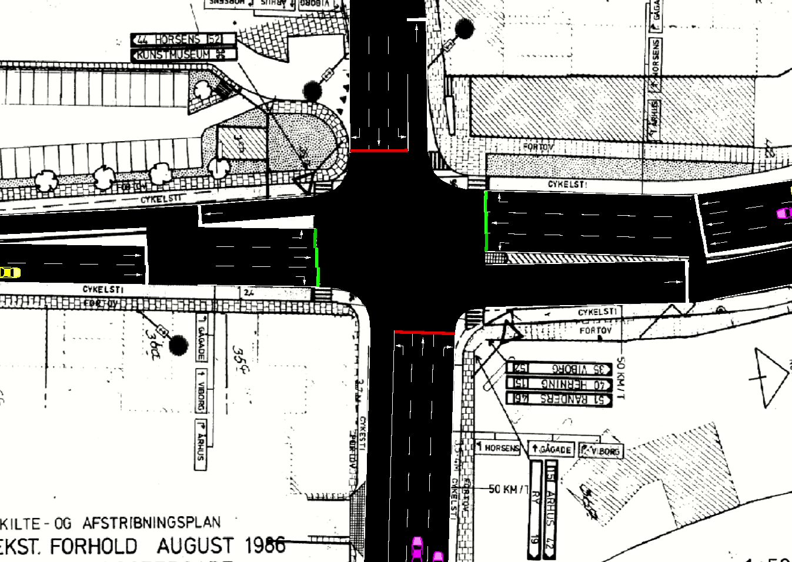

In addition to that let us model the provided solution signal plan. The plan does not have left turns and its `tlLogic` will look as follows:

### Solution signal plan
As a solution to TT-5 Exercise 1 the signal plan can be written in SUMO format. This plan does not have a left turning phase. 
```xml
<additionals>
<!-- in solution_lights.add.xml-->
    <tlLogic id="C" type="static" programID="1" offset="0">

        <!-- West-East-->
        <phase duration="28" state="rrrGGgrrrGGg"/>
        <phase duration="4"  state="rrryyyrrryyy"/>
        <phase duration="1"  state="yyyrrryyyrrr"/>

        <!-- North-South-->
        <phase duration="19" state="GGgrrrGGgrrr"/>
        <phase duration="4"  state="yyyrrryyyrrr"/>
        <phase duration="3"  state="rrrrrrrrrrrr"/>
        <phase duration="1"  state="rrryyyrrryyy"/>
    </tlLogic>
</additionals>
```

```sh
sumo-gui -n network.net.xml -r demands.rou.xml -a solution_lights.add.xml 
```

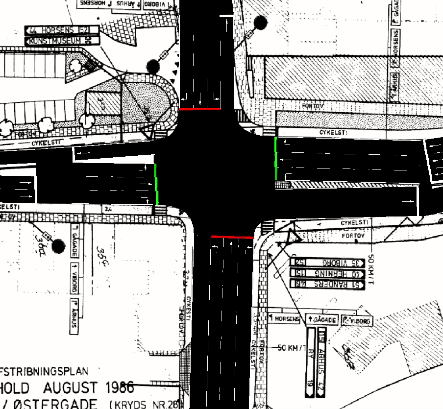

### Comparing results

To compare the 2 SUMO signal plans and the solution plan we will use [`tripStatistics.py`](https://sumo.dlr.de/docs/Tools/Output.html#tripstatisticspy) tool. First, we need to generate a `tripinfo` output from our simulation. Tripinfo describes simulated vehicles trip including start and finish times, delay, number of stops. etc. We can generate the output adding `--tripinfo-output` flag, and run `sumo` without the user interface instead of `sumo-gui` to save some time since we have already seen the visuals.

```sh
# original SUMO pre-timed plan
sumo -n network.net.xml -r vehicle_demands.rou.xml --tripinfo-output base_tripinfo.xml

# optimized SUMO pre-timed plan
sumo -n network.net.xml -r vehicle_demands.rou.xml -a optimal_lights.add.xml --tripinfo-output optimal_tripinfo.xml

# pre-timed plan from exercise solution
sumo -n network.net.xml -r vehicle_demands.rou.xml -a solution_lights.add.xml --tripinfo-output solution_tripinfo.xml
```

Now we can use `tripStatistics.py` to summarize all vehicle trips and compare them. 
Windows:
```sh
python "%SUMO_HOME%\\tools\\output\\tripStatistics.py" -t base_tripinfo.xml -o base_summary.txt

python "%SUMO_HOME%\\tools\\output\\tripStatistics.py" -t optimal_tripinfo.xml -o optimal_summary.txt

python "%SUMO_HOME%\\tools\\output\\tripStatistics.py" -t solution_tripinfo.xml -o solution_summary.txt
```

Linux / macOS:
```sh
python $SUMO_HOME/tools/output/tripStatistics.py -t base_tripinfo.xml -o base_summary.txt

python $SUMO_HOME/tools/output/tripStatistics.py -t optimal_tripinfo.xml -o optimal_summary.txt

python $SUMO_HOME/tools/output/tripStatistics.py -t solution_tripinfo.xml -o solution_summary.txt
```

| Metric | SUMO (proposed) | SUMO (optimized) | Manual solution |
|---|---|-----|---|
| Average waiting time (s)    | 424.0 | 648.4 | **269.7** |
| Average travel time (s)     | 49.7  | 56.5  | **48.1**  |
| Average travel speed (m/s)  | **3.7**   | 2.6   | 3.6   |

As you see the solution plan without left turns is better in all but average travel speed metric. This is because by default SUMO will always add a left turning phase if the left turning connection exists. This will happen regardless of whether the volume of left turns requires having a dedicated phase. As to the optimization with `tlsCycleAdaptation.py` we simply asked SUMO to improve the phase durations and not the phase sequence, so SUMO was not responsble for suggesting a better phase sequence.

## Part 2:
- Model another similar intersection on the western approach
- Generate new demand that includes western intersection, make sure most of the traffic happens between the intersections
- Experiment with simulating different coordination offsets manually
- Calculate optimal coordination offset with [tlsCoordinator.py](https://sumo.dlr.de/docs/Tools/tls.html#tlscoordinatorpy)

### Extending the network
Unfortunately for us `netedit` does not provide good shortcuts for extending the network like copy / paste / mirror operations you are familiar with from say AutoCAD. Lets extend our network to the west in an arbirary way.

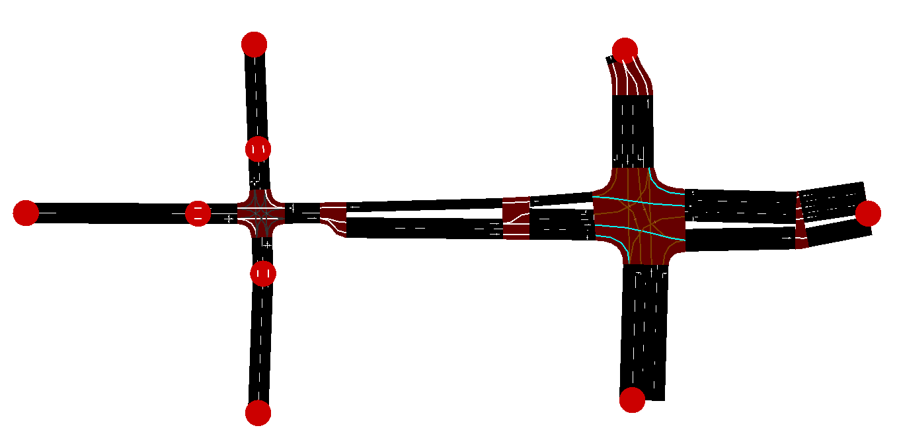

Lets continue by tweaking the gemetry using the move operations and offsets (Shift + Left Click). We will also add a traffic light and customize the names similarly to the previous part in order to assign the demands.

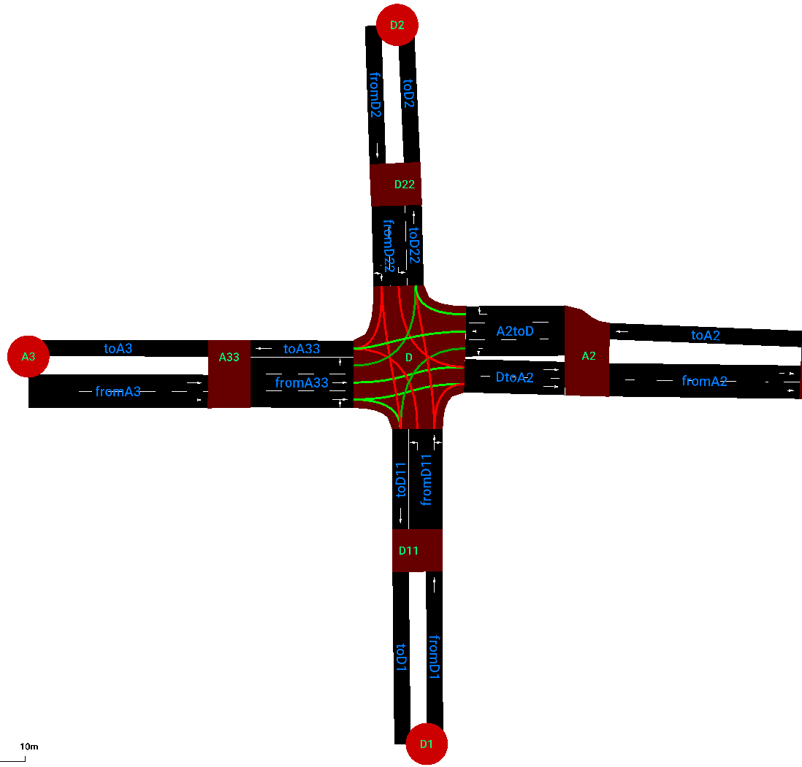

### Demand generation

Lets generate the demand using `randomTrips.py` and use `--fringe-factor` parameter according to [this doc](https://sumo.dlr.de/docs/Tools/Trip.html#edge_probabilities). Fringe factor assign higher probability to the edges at the boundary of the network to be origins or destinations, so all the flow will go through the center of the network. We will also weight the edges with more lanes using `-L` parameters and `--remove-loops` to disallow re-entering the network from outgoing edges. The perioid `-p` is chosen to be every 2 seconds, however, depending on the routing some impossible trips will be thrown away and actual period will be lower. We will also use `-r / --route-file` output flag instead of `-o / --output-trip-file` to get our demand in `vehicle` / `route` format rather than `trip` or `flow`. This way we dont have to call `duarouter` to convert the demands before using the `tlsCoordinator.py` tool.

Windows:
```sh
python "%SUMO_HOME%/tools/randomTrips.py" -n extended_network.net.xml -r extended_routes.rou.xml --fringe-factor 10 -L --remove-loops -p 2
```

Linux / macOS:
```sh
python $SUMO_HOME/tools/randomTrips.py -n extended_network.net.xml -r extended_routes.rou.xml --fringe-factor 10 -L --remove-loops -p 2
```

Simulate the results:

```xml
sumo-gui -n extended_network.net.xml -r extended_routes.rou.xml
```

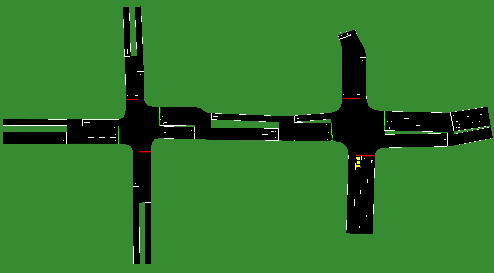

### Coordination

Lets optimize the coordination offset between the intersections D and C and see whether it leads to any imporvements. We will use `tlsCoordinator.py` from [this doc](https://sumo.dlr.de/docs/Tools/tls.html#tlscoordinatorpy)

Windows:
```sh
python "%SUMO_HOME%\\tools\\tlsCoordinator.py" -n extended_network.net.xml -r extended_routes.rou.xml -o D_C_offset.add.xml
```

Linux / macOS:
```sh
python $SUMO_HOME/tools/tlsCoordinator.py -n extended_network.net.xml -r extended_routes.rou.xml -o D_C_offset.add.xml
```

As a result we obtained the file with following content:
```xml
<additional>
    <!-- in D_C_offset.add.xml-->
    <tlLogic id="C" programID="0" offset="0.00"/>
    <tlLogic id="D" programID="1" offset="51.68"/>
</additional>
```

### Results

Lets generate a `tripinfo` from base and optimal coordination. Remember to add the `D_C_offset.add.xml` additional file to the second simulation:

```sh
# original SUMO coordination
sumo -n extended_network.net.xml -r extended_routes.rou.xml --tripinfo-output base_extended_tripinfo.xml

# optimized SUMO coordination
sumo -n extended_network.net.xml -r extended_routes.rou.xml -a D_C_offset.add.xml --tripinfo-output optimal_extended_tripinfo.xml
```

Now we can use `tripStatistics.py` to summarize all vehicle trips and compare them. 

Windows:
```sh
python "%SUMO_HOME%\\tools\\output\\tripStatistics.py" -t base_extended_tripinfo.xml -o base_extended_summary.txt

python "%SUMO_HOME%\\tools\\output\\tripStatistics.py" -t optimal_extended_tripinfo.xml -o optimal_extended_summary.txt
```

Linux / macOS:
```sh
python $SUMO_HOME/tools/output/tripStatistics.py -t base_extended_tripinfo.xml -o base_extended_summary.txt

python $SUMO_HOME/tools/output/tripStatistics.py -t optimal_extended_tripinfo.xml -o optimal_extended_summary.txt
```

| Metric | base | optimized |
|---|---|-----|
| Average waiting time (s)    | 24.1  | 23.9  |
| Average travel time (s)     | 48.5  | 47.4  |
| Average travel speed (m/s)  | 4.8   | 4.8   |

We can obeserve some, but insignificant, improvement which suggests that for this traffic volume the coordination is likely not beneficial to optimize, and we should search for improvement somewhere else, for example improving the delay of individual intersections by phase selection or responsive / adaptive traffic control.

## Exercise 2
Using the intersection from Exercise 1 part 1:
- Change the controller to time-gap based and output tripinfo
- Change the controller to the time loss based and output tripinfo
- Compare them to the results pre-timed control

Lets consider a solution signal plan without left turn and extend its definition with [time gap](https://sumo.dlr.de/docs/Simulation/Traffic_Lights.html#based_on_time_gaps) and [delay based](https://sumo.dlr.de/docs/Simulation/Traffic_Lights.html#based_on_time_loss) control.

### Time gap controller
Lets create a new file `time_gap_solution_lights.add.xml` with following content:

```xml
<additionals>
    <!-- time_gap_solution_lights.add.xml -->
    <tlLogic id="C" type="actuated" programID="1" offset="0">
        <param key="max-gap" value="3.0"/>
        <param key="detector-gap" value="1.5"/>
        <param key="show-detectors" value="true"/>

        <phase duration="28" minDur="15" maxDur="40" state="rrrGGgrrrGGg"/>
        <phase duration="4"  state="rrryyyrrryyy"/>
        <phase duration="1"  state="yyyrrryyyrrr"/>
        <phase duration="19" minDur="15" maxDur="40" state="GGgrrrGGgrrr"/>
        <phase duration="4"  state="yyyrrryyyrrr"/>
        <phase duration="3"  state="rrrrrrrrrrrr"/>
        <phase duration="1"  state="rrryyyrrryyy"/>
    </tlLogic>
</additionals>
```

Notice `actuated` type as well as `max-gap` and `detector-gap` parameters to describe when the detector no longer _sees_ a queue and how far the detector is from the intersection (in seconds). For the onyl 2 non-transitional phases we will add a minimum and maximum phase duration arbitrarily between 15 and 40 seconds. Other phases will follow prescribed duration strictly.

```sh
sumo-gui -n network.net.xml -r vehicle_demands.rou.xml -a time_gap_solution_lights.add.xml 
```

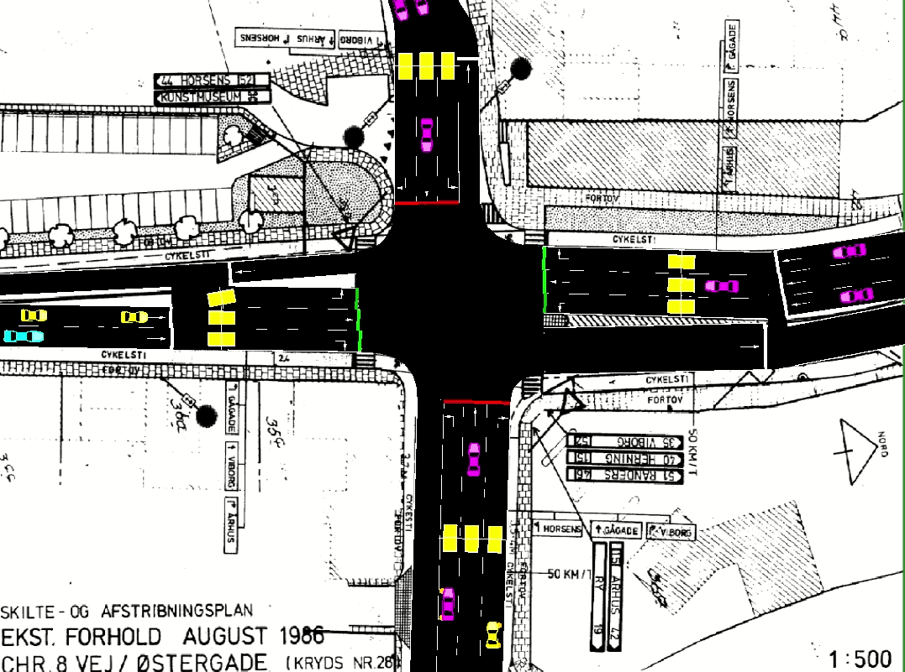

### Delay based controller

Lets create a new file `delay_based_solution_lights.add.xml` with following content:

```xml
<additionals>
    <!-- delay_based_solution_lights.add.xml -->
    <tlLogic id="C" type="delay_based" programID="1" offset="0">
        <param key="detectorRange" value="25"/>
        <param key="minTimeLoss" value="1" />
        <param key="show-detectors" value="true"/>

        <phase duration="28" minDur="15" maxDur="40" state="rrrGGgrrrGGg"/>
        <phase duration="4"  state="rrryyyrrryyy"/>
        <phase duration="1"  state="yyyrrryyyrrr"/>
        <phase duration="19" minDur="15" maxDur="40" state="GGgrrrGGgrrr"/>
        <phase duration="4"  state="yyyrrryyyrrr"/>
        <phase duration="3"  state="rrrrrrrrrrrr"/>
        <phase duration="1"  state="rrryyyrrryyy"/>
    </tlLogic>
</additionals>
```

Notice `delay_based` type as well as `detectorRange` and `minTimeLoss` parameters to describe detector length and a critical accumulated delay time after which detector requests extension of the phase. For the onyl 2 non-transitional phases we will add a minimum and maximum phase duration arbitrarily between 15 and 40 seconds.

```sh
sumo-gui -n network.net.xml -r vehicle_demands.rou.xml -a delay_based_solution_lights.add.xml 
```

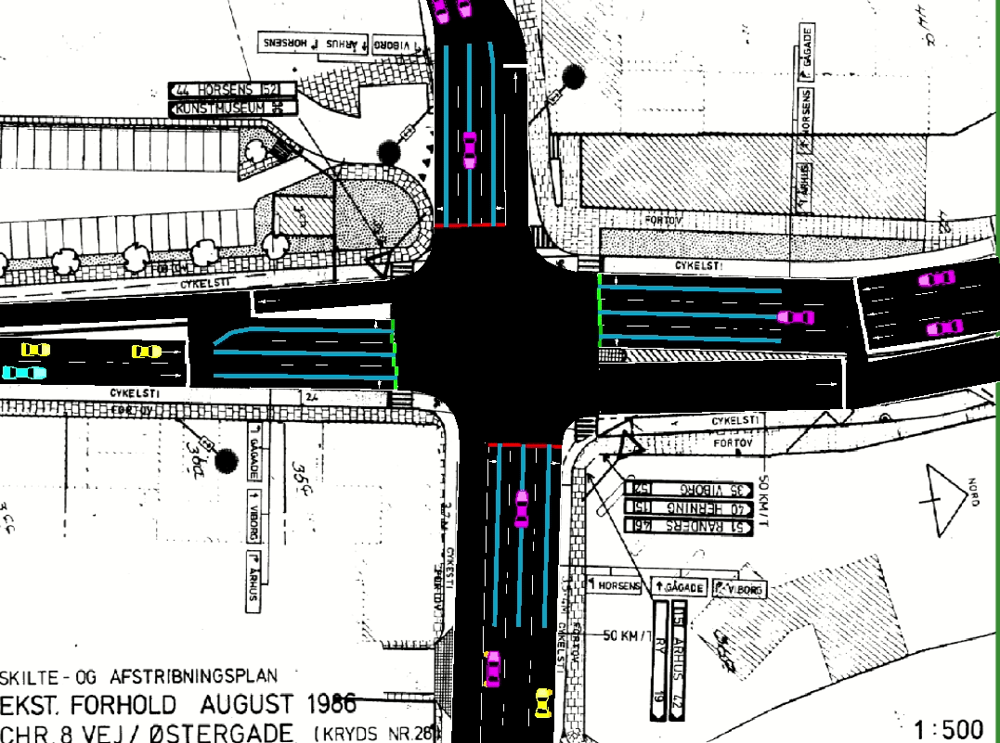

### Results

Lets generate a `tripinfo` from both time-gap and delay based controllers. Remember to add the appropriate `*.add.xml` additional file to the simulations:

```sh
# time-gap control
sumo -n network.net.xml -r vehicle_demands.rou.xml -a time_gap_solution_lights.add.xml --tripinfo-output time_gap_tripinfo.xml

# delay based control
sumo -n network.net.xml -r vehicle_demands.rou.xml -a delay_based_solution_lights.add.xml --tripinfo-output delay_based_tripinfo.xml
```

Now we can use `tripStatistics.py` to summarize all vehicle trips and compare them. 

Windows:
```sh
python "%SUMO_HOME%\\tools\\output\\tripStatistics.py" -t time_gap_tripinfo.xml -o time_gap_summary.txt

python "%SUMO_HOME%\\tools\\output\\tripStatistics.py" -t delay_based_tripinfo.xml -o delay_based_summary.txt
```

Linux / macOS:
```sh
python $SUMO_HOME/tools/output/tripStatistics.py -t time_gap_tripinfo.xml -o time_gap_summary.txt

python $SUMO_HOME/tools/output/tripStatistics.py -t delay_based_tripinfo.xml -o delay_based_summary.txt
```

| Metric | SUMO (proposed) | SUMO (optimized) | Manual solution | Time-gap actuated | Delay based |
|---|---|-----|---|---|---|
| Average waiting time (s)    | 424.0 | 648.4 | **269.7** | 373.9 | 318.5|
| Average travel time (s)     | 49.7  | 56.5  | **48.1**  | 48.6  | **48.1**|
| Average travel speed (m/s)  | 3.7   | 2.6   | 3.6   | **4.2**   | 3.9|

As you can see the traffic responsive control lets the vehicles pass the intersection faster and gave similar travel times even though the waiting times were bigger. Bear in mind that we have not tuned any of the detector parameters to optimize the controller. In addition, it seems that the pre-timed solution fits well to the demand we have generated, namely, a steady, dense, uniform flow of vehicles. A more non-steady flow would very likely be better tackled by the traffic responsive control or more advanced traffic adaptive controllers.


