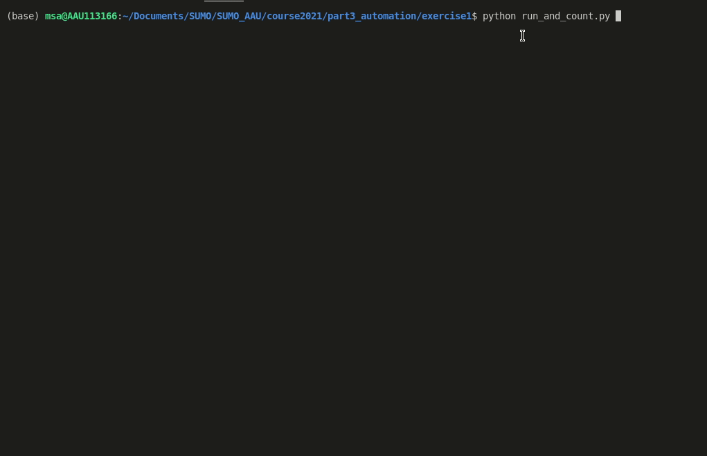
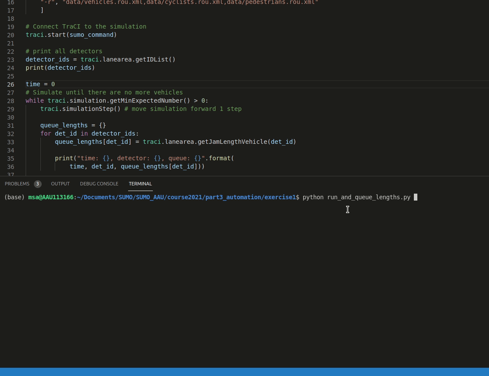

## Exercise 1
Pick any intersection you have done with SUMO:
- Create python code that lets you run the simulation:
    - Once with sumo-gui command
    - Once with sumo command
    - 5 times with sumo command
- Run simulation once with sumo. For each timestep use the documentation, calculate and print out:
    - The number vehicles present in the intersection
    - Average speed of all vehicles
    - Queue length on each approach edge

The network, demand and additional files for the simulation are given in `data` folder and can be previewed with `netedit`.
- network: `cross.net.xml`
- demands: `vehicles.rou.xml`, `cyclists.rou.xml`, `pedestrians.rou.xml`
- additionals - detectors: `radars.add.xml`
- additionals - traffic plan: `early_biles.tll.xml`

```sh
netedit data/cross.net.xml
```

### Simulate once
In order to run the simulation from TraCI we will follow the approach seen earlier in the course in [this example](https://github.com/TRG-BUILD/sumo_course/tree/master/course2021/part3_automation/example1). 

In a new python file `run_once.py`:
```python
# Ensure Python knows where TraCI is
import os, sys
if 'SUMO_HOME' in os.environ:
    tools = os.path.join(os.environ['SUMO_HOME'], 'tools')
    sys.path.append(tools)
else:
    sys.exit("please declare environment variable 'SUMO_HOME'")

import traci

# compose the SUMO simulation command
sumo_command = [
    "sumo-gui",
    "-n", "data/cross.net.xml",
    "-a", "data/radars.add.xml,data/early_bikes.tll.xml",
    "-r", "data/vehicles.rou.xml,data/cyclists.rou.xml,data/pedestrians.rou.xml"
    ]

# Connect TraCI to the simulation
traci.start(sumo_command)

# Simulate until there are no more vehicles
while traci.simulation.getMinExpectedNumber() > 0:
    traci.simulationStep() # move simulation forward 1 step

# disconnect
traci.close()
```

### Simulate many times
Simulating many times is as easy wrapping the connect-step-disconnect routine into a `for` loop.

In a new python file `run_many.py`:
```python
# Ensure Python knows where TraCI is
import os, sys
if 'SUMO_HOME' in os.environ:
    tools = os.path.join(os.environ['SUMO_HOME'], 'tools')
    sys.path.append(tools)
else:
    sys.exit("please declare environment variable 'SUMO_HOME'")

import traci

# how many times to run?
n_runs = 5

# compose the SUMO simulation command
sumo_command = [
    "sumo",
    "-n", "data/cross.net.xml",
    "-a", "data/radars.add.xml,data/early_bikes.tll.xml",
    "-r", "data/vehicles.rou.xml,data/cyclists.rou.xml,data/pedestrians.rou.xml"
    ]

for i in range(n_runs):
    # Connect TraCI to the simulation
    # Note: if sumo command is different every time it should be within the loop
    traci.start(sumo_command)

    # Simulate until there are no more vehicles
    while traci.simulation.getMinExpectedNumber() > 0:
        traci.simulationStep() # move simulation forward 1 step

    # disconnect
    traci.close()
```

### Simulate interventions
Introducing your own data extraction or update logic into the simulation happens in the `while` loop of the TraCI setup.

```python
# ...
traci.start(sumo_command)

while traci.simulation.getMinExpectedNumber() > 0:
    traci.simulationStep()
    
    ###
    # -> After simulation update your own custom logic goes here <-
    ###

traci.close()
```

We will re-use this setup to solve next 4 tasks, unless specified all pieces of code outside the `while` loop are similar to what you have seen before.

#### Count vehicles in the network
Counting vehicles in the network can be boiled down to summing vehicle counts on individual edges. For that `traci.edge` namespace can be used to get all sorts of data about edges according to [this doc](https://sumo.dlr.de/pydoc/traci._edge.html).

In `run_and_count.py`:
```python
# ...

# print all edges
edge_ids = traci.edge.getIDList()
print(edge_ids)

time = 0
# Simulate until there are no more vehicles
while traci.simulation.getMinExpectedNumber() > 0:
    traci.simulationStep() # move simulation forward 1 step
    
    n_vehicles = 0
    for e_id in edge_ids:
        n_on_edge = traci.edge.getLastStepVehicleNumber(e_id)
        n_vehicles += n_on_edge

    print("time: {}, vehicles: {}".format(time, n_vehicles))

    time += 1

# ...
```


An important detail is that all cyclists are also vehicles in SUMO, in order to filter them out we need to look into [vehicle classes](https://sumo.dlr.de/docs/Definition_of_Vehicles%2C_Vehicle_Types%2C_and_Routes.html#abstract_vehicle_class) and count those of type `passenger`. Therefore, instead of vehicle number we will request vehicle IDs and use it to extract the passenger vehicles using `traci.vehicle` namespace according to [this doc](https://sumo.dlr.de/pydoc/traci._vehicle.html).

In `run_and_count2.py`:
```python
# ...

# print all edges
edge_ids = traci.edge.getIDList()
print(edge_ids)

time = 0
# Simulate until there are no more vehicles
while traci.simulation.getMinExpectedNumber() > 0:
    traci.simulationStep() # move simulation forward 1 step
    
    n_vehicles = 0
    for e_id in edge_ids:
        vehicle_ids = traci.edge.getLastStepVehicleIDs(e_id)
        for v_id in vehicle_ids:
            v_class = traci.vehicle.getVehicleClass(v_id)
            if v_class == "passenger":
                n_vehicles += 1

    print("time: {}, vehicles: {}".format(time, n_vehicles))

    time += 1

# ...
```

#### Average speed of all vehicles
`run_and_count2.py` from above can be mostly re-used to calculate average vehicle speeds. `traci.vehicle` again can be used to obtain individual vehicles speed as long as it is of a correct class `passenger`.

In `run_and_speed_average.py`:
```python
# ...

# print all edges
edge_ids = traci.edge.getIDList()
print(edge_ids)

time = 0
# Simulate until there are no more vehicles
while traci.simulation.getMinExpectedNumber() > 0:
    traci.simulationStep() # move simulation forward 1 step
    
    n_vehicles = 0
    speed_sum = 0
    for e_id in edge_ids:
        vehicle_ids = traci.edge.getLastStepVehicleIDs(e_id)
        for v_id in vehicle_ids:
            v_class = traci.vehicle.getVehicleClass(v_id)
            if v_class == "passenger":
                n_vehicles += 1
                speed_sum += traci.vehicle.getSpeed(v_id)

    # to avoid division by 0
    avg_speed = 0
    if n_vehicles > 0:
        avg_speed = speed_sum / n_vehicles
 
    print("time: {}, vehicles: {}, avg_speed: {}".format(
        time, n_vehicles, avg_speed))

    time += 1

# ...
```

#### Queue length on each approach edge
Queue lengths on the approach edges can be calculated in a similar way to vehicle counts, however, not all the edges are the approach edges, therefore some sort of edge filtering is required. Forunately, the fact that we have the approach detectors `radars.add.xml` defined in our simulation that we can use. Since our detectors are [lanearea detectors E2](https://sumo.dlr.de/docs/Simulation/Output/Lanearea_Detectors_%28E2%29.html) we have to use `traci.lanearea` namespace according to [this doc](https://sumo.dlr.de/pydoc/traci._lanearea.html). We will use a python dictionary to store the information in a `key: value` format as `approach_name: queue_size`.

In `run_and_queue_lengths.py`:
```python
# ...

# print all detectors
detector_ids = traci.lanearea.getIDList()
print(detector_ids)

time = 0
# Simulate until there are no more vehicles
while traci.simulation.getMinExpectedNumber() > 0:
    traci.simulationStep() # move simulation forward 1 step
    
    queue_lengths = {}
    for det_id in detector_ids:
        queue_lengths[det_id] = traci.lanearea.getJamLengthVehicle(det_id)

        print("time: {}, detector: {}, queue: {}".format(
            time, det_id, queue_lengths[det_id]))

    # for spacing
    print()
    time += 1

# ...
```


